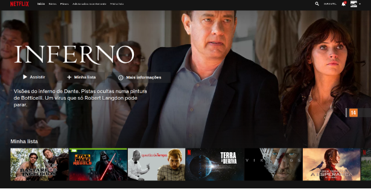
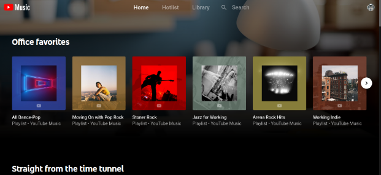

# Prova Prática

Desenvolver uma landing page, baseada na página principal do Youtube  Music e Netflix.

A página pode ser do tema que o candidato preferir, devendo apenas seguir e a mesma estrutura visual e contendo os itens apresentados nos requisitos a seguir.

Requisitos:

- Header com logo da aplicação, itens do menu e item de menu do usuário (avatar). O Header deve ter fundo transparente quando o scroll da página estiver no topo e alterar para um fundo opaco quando for realizado o 	scroll
-   Um item principal em destaque
-   Listagem dos itens organizados em Carrossel
-   Footer contendo informações do desenvolvedor





Será avaliado:

-   Boas práticas de organização e estruturação do CSS SEM frameworks
-   Boas práticas de organização, estruturação e semântica do HTML5    
-   Boas práticas do uso do Javascript e a manipulação do D.O.M.  SEM frameworks
-   Utilização do CSS Grid na estruturação da página    
-   Responsividade da página    
-   Apenas será avaliado a primeira página da aplicação (home)


# Perguntas Mestre dos códigos Javascript

1 Explique com suas palavras a diferença entre a utilização de var, const e let?

--- 
2 Assinale a(s) diferença(s) entre Funções normais e Arrow Functions?

[ ] Funções normais não guardam escopo 
[ ] Funções normais guardam escopo
[ ] Arrow function são mais rápidas
[ ] Arrow function podem ser instanciadas
[ ] Arrow function não guardam escopo 

---

3 qual o valor da variavél name após a execução da função?
```javascript
 content = {
  name: "John",
  getName: function() {
    this.name = "James"
    return this.name
  }
}

userData = {
  name: "Luke",
  getName: content.getName
}
this.name = "Walter"
const name = userData.getName()

```
[ ] John 

[ ] Luke

[ ] James

[ ] Walter


3 Qual o retorno da seguinte função 
```javascript
function Event(name, day) {
  this.date = day
  this.name = name

  this.getName = function() {
    return this.name
  }
  this.getDate = function() {
    return this.date
  }
}

const event = new Event("04/02/2019", "Event Test")

Event.prototype.getTitle = function() {
  return `The event ${this.name} will take place on ${this.date} `
}
event.getTitle()

```
[ ] The event 04/02/2019 will take place on Event Test

[ ] The event undefined will take place on undefined

[ ] Uncaught TypeError

[ ] The event null will take place on null


4 Quais são as formas de selecionar um elemento na DOM e qual a diferença entre elas? 

 --- 
5 Como inserir um evento em determinado elemento? 

 ---
6 Como remover um evento em determinado elemento?

---
7 Descreva com suas palavras o que é event bubbling?

--- 
8 Descreva qual a diferença nos métodos de declaração de objetos? 
```javascript
const object = {}
const object = new Object()
const object = Object.create()
```
--- 
 9 Qual a diferença no uso de XMLHttpRequest e Fetch ? E qual devemos usar atualmente ?

--- 

10 O que são Promises ? Como podemos declarar uma promise em javascript ? 

--- 

11 - Liste 3 formas de iterar um Array em javascript e explique a diferença entre cada um deles? 

---

12 - Quando utilizar map, reduce ou filter ? 

---

13 - Qual o método do Array é mais indicado para remover elementos ? 

---

14 - Cite 4 métodos presentes na API de strings do Javascript e explique cada um deles; 

---

15 - LocalStorage / SessionStorage / Cookies 
Escreva um código para inserir e resgatar items do LocalStorage/SessionStorage

---

16 - Qual a melhor forma para definir um cookie utilizando javascript ?

---

17 - Loops 
Quais os tipos de Loops existentes em javascript ?

---

18 - Descreva com suas palavras o que é hoisting ?

---

19 - Em um ambiente do browser. Qual o valor do this utilizando "use-strict";

[] window

[] global

[] undefined

[] null

20 - Quando eu posso utilizar o "Use-strict" no meu código ?

[] No ínicio do meu código

[] No inicio do block if

[] No inicio de um loop

[] no inicio de uma função 
